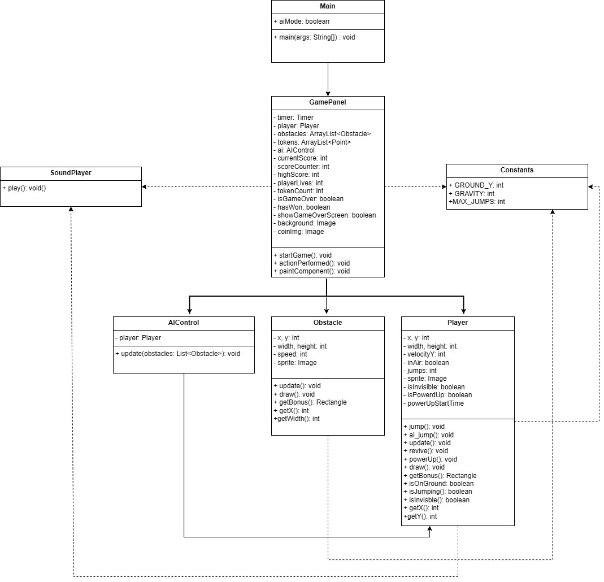

TITLE: MoonWalk – AI Jump Rush

Submitted To    : Dr AGRET Clement 

Submission Date : 30.04.2025

1. Introduction

SkySurge – AI Jump Rush is a 2D side-scroller auto-runner game developed using Java and the Swing GUI toolkit. The player (or an AI) navigates through a continuous stream of obstacles while collecting coins. The objective is to reach a specific score threshold without running out of lives.

The game explores core programming concepts such as object-oriented design, collision detection, event-driven programming, file handling, and artificial intelligence in the form of simple decision-making logic. By combining visuals, logic, sound, and interactivity, this project simulates a lightweight arcade experience in desktop Java.

2. Team Members:
Zahrah Suffee (ID: 2315249)

Shreya Doorgachurn  (ID: 2312862)

Oushvina Seewoobudut (ID:2314942)

Chetanand Dussuruth (ID: 2314830)

Each team member contributed to different parts of the project, including game logic, AI behavior, player controls, obstacle dynamics, and documentation.The team collaborated using GitHub for version control and seamless integration of contributions.

3. Game Rules and Mechanics:

        1. The game begins in AI Mode or User Mode, depending on the player's selection.

        2. The player-controlled entity continuously runs forward (automatically).

        3. In User Mode, the spacebar is used to make the player jump. The player can jump up to three times without touching the ground.

        4. In AI Mode, the computer decides when to jump based on obstacle proximity and jump status.

        5. Players must avoid oncoming obstacles. A collision results in the loss of a life.

        6. Players begin with three lives.

        7. Players can collect coins (tokens) scattered in the level. Collecting 5 tokens grants one additional life and temporarily increases the player's size,like powerburst before regaining its original size.

        8. The game ends in a win when the player reaches a score of 2000 points.

        9. The game ends in a loss if all lives are lost before the score goal is reached.

 4. Project Structure

Folder	        Contents
/game	        Main game logic (Main.java, GamePanel.java)
/ai	            AI control logic (AIControl.java)
/model	        Core game entities (Player.java, Obstacle.java)
/utils	        Utility classes (SoundPlayer.java, Constants.java)
/assets	        Game assets (backgrounds, sprites, sound effects)
score.txt	    Stores the highest score for persistence

5. Features:

        1. Smart AI with distance-based obstacle awareness

        2. Power-up system with token collection

        3. Triple jump capability

        4. Token-based life recovery

        5. Endgame screen showing score and high score status

        6. Fullscreen immersive layout

        7. Sound feedback for all key actions (jump, win, game over)

        8. Text File for storing the highest score and then comparing with existing one to determine whether a higher score has been attained 

6. Limitations (With Suggested Solutions):

        1. No Pause or Resume Functionality

        Limitation: The game cannot be paused or resumed during play.

        Solution: Implement a KeyListener for the "P" key to toggle game pause using timer.stop() and timer.start().

        2. Single Type of Obstacle and Token

        Limitation: The game only features one obstacle sprite and one token type.

        Solution: Create subclasses of Obstacle and implement polymorphism for varied behavior (e.g., bouncing, flying).

        3. AI Does Not Perform Triple Jump

        Limitation: Although triple jump is supported, the AI currently only performs a single jump and does not chain up to three jumps in air.

        Solution: Enhance the AIControl class logic to check not only if the player is on the ground or jumping, but also how many jumps have been performed. Add a jump counter reference or expose that logic from the Player class.

7. Additional Features Implemented:

        1. UserPlayer jump logic with mid-air triple jump support

        2. Revive invisibility mechanic upon collision with an obstacle

        3. High score storage in local file (score.txt)

        4. Score-dependent win condition

        5. Sound-driven feedback cues (jump, win, death)

        6.Power-Up Animation: Visual size increase upon token collection.

        7.Full-screen mode: Game starts in maximized screen.

8. Class Diagram 
 

9. Team Contributions

        1. Zahrah Suffee

            Developed AI obstacle avoidance logic

            Programmed GamePanel structure and game loop

            Integrated collision handling and revive power-up logic

        2. Shreya Doorgachurn 

            Implemented Obstacle and Token systems

            Managed spawn logic and rendering optimizations

        3. Seewoobudut Oushvina

            Integrated SoundPlayer class and file-based scoring system

            Developed Win/Loss logic and endgame dialog display

        4. Dussuruth Chetanand 

            Organized Constants.java configuration

            Handled keyboard input controls and game mode selection

10. Code and Function Overview:

        1. Main.java

            Role: Launches the game and provides game mode selection

            Functions:

            main(String[] args) – Opens dialog for AI/User mode and initializes GamePanel in fullscreen mode

        2. GamePanel.java

            Role: Core game loop and logic container

            Functions:

            GamePanel() – Constructor that loads assets and sets up the scene

            startGame() – Initializes game state variables and starts the game loop

            actionPerformed(ActionEvent e) – Main timer loop; updates game state every 15ms

            spawnObstacles() – Adds new obstacle at random intervals with adjustable offset

            spawnTokens() – Spawns tokens occasionally to reward player

            checkCollisions() – Detects player-obstacle collisions, reduces life, triggers revive

            checkTokenPickup() – Checks if the player collected tokens and applies power-up

            paintComponent(Graphics g) – Draws game scene including player, obstacles, tokens, and text UI

            saveHighScore() / loadHighScore() – Reads and writes top score to file

        3. AIControl.java

            Role: Controls player behavior in AI mode

            Functions:

            update(List<Obstacle>) – Checks obstacle distance, triggers AI jump logic if the player is near and able to jump

        4. Player.java

            Role: Manages all player-related actions

            Functions:

            jump() / ai_jump() – Applies vertical velocity if player hasn’t exceeded jump limit

            update() – Applies gravity and resets jump on ground contact

            revive() – Temporarily hides player for 1 second to avoid double hits

            powerUp() – Temporarily increases size to indicate power-up

            draw(Graphics) – Renders sprite or invisibility

            getBounds() – Provides hitbox for collision checks

        5. Obstacle.java

            Role: Represents obstacles with movement and visuals

            Functions:

            update() – Moves obstacle toward the player

            draw(Graphics) – Displays the obstacle image or fallback color

            getBounds() – Rectangle for collision detection

        6. Constants.java

            Role: Centralized constants configuration for tuning values

            Values:

            GROUND_Y – Vertical floor position

            GRAVITY – Jump physics constant

            MAX_JUMPS – Number of allowed jumps before touching the ground

        7. SoundPlayer.java

            Role: Plays sound effects for feedback

            Function:

            play(String soundFile) – Opens a .wav file and plays the clip using Clip and AudioInputStream

10. References:

Java Swing Documentation – Oracle

Java Audio System – javax.sound.sampled

Stack Overflow (for bounding box collision and file handling)

Class lectures and Java Game Design practicals

GeeksForGeeks, TutorialsPoint – used for code snippets and inspiration

11. How to Run The Game:

        1. Place all files in respective packages:

            game.engine → Main.java, GamePanel.java

            game.model → Player.java, Obstacle.java

            game.ai → AIControl.java

            game.utils → Constants.java, SoundPlayer.java

        2. Ensure assets/ directory exists with all image and sound files:

            1. player.png, obstacle.png, coin.png, background.png

            2. jump.wav, win.wav, gameover.wav

        3. Open the project in a Java IDE (e.g., IntelliJ, Eclipse, VS Code with Java)

        4. Compile and run Main.java

        5. Select your desired game mode and start playing!

Thank you for reviewing our project – SkySurge: AI Jump Rush. We hope you enjoyed the experience as much as we did creating it!

